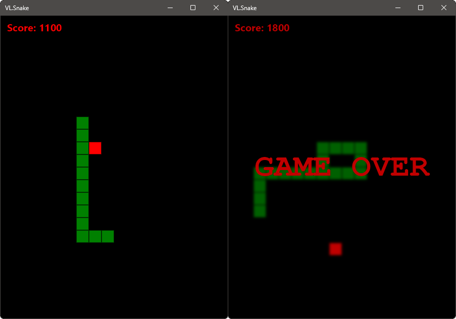

# VL.Snake

A simple implementation of the classic game Snake in VL.

## Game Instructions

You can use the arrow keys to move the head of the snake in the desired direction.

You can reset the game by pressing the 'R' key.

Inside vvvv you can also specify the board's width and height, as well as the tile size.

## Credits

Based on [this](https://www.youtube.com/watch?v=Y62MJny9LHg) video tutorial by [Kenny Yip](https://www.youtube.com/@KennyYipCoding).

---

Made with [vvvv](https://visualprogramming.net/).
